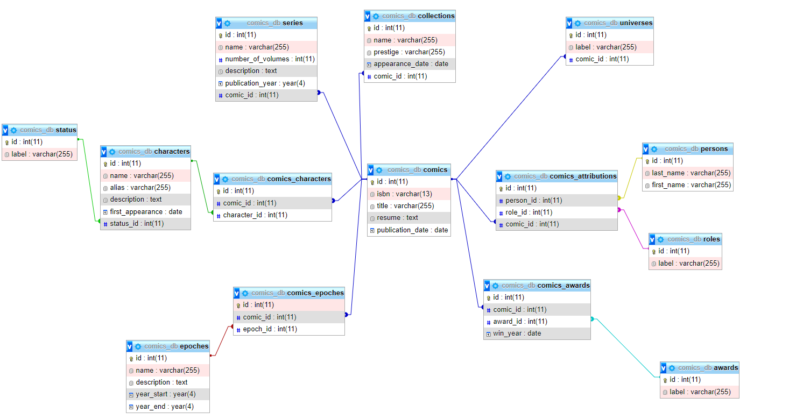

# BRIEF 
En utilisant les informations du MCD. Vous devez procéder aux corrections qui vous semblent nécessaires. Puis créer la base de données sous MySQL.

# CONTEXTE
Partir d'un MCD et produire une base de données.

# ANNEXE

# ANALYSE DE L'EXISTANT

## Comics & Editeurs

### Problème(s)
Les propriétés Scénariste et Dessinateur sont redondantes et risque d'apporter des incohérences. Par exemple, prenons une dessinatrice Jeanne MAS qui est intervenue sur plusieurs enregistrements de cette entité. Demain, Jeanne se marie et son nom de famille devient YOLO, il faudra donc modifier chacun des enregistrements où se trouve Jeanne en tant que dessinatrice en oubliant aucun enregistrement.
On est dans le cas de la "Troisième forme normale" où tout attribut d'une entité doit dépendre de l'identifiant par une dépendance fonctionnelle directe.

Nous avons également des incohérences de type de données pour (isbn et datePublication)
### Solution(s)
La date de publication est indiquée au format DateTime or nous n'avons pas besoin de stocker l'heure précise ainsi son type devient DATE.
L'ISBN a un type integer mais par précautions je le transforme en varchar avec un maximum et un minimum de 13 charactères car ils 'agit d'une normalisation internationale et il sera toujours composé de 13 chiffres
Pour les éditeurs, dessinateur et scénaristes, je prends l'hypothèse suivante :
Un dessinateur peut être à la fois dessinateur et scénariste sur un comic. De plus, selon mes recherches il y a encore d'autres rôles sur un comic.
Il peut y avoir également plusieurs éditeurs sur un même comic.
Après reflexion, il est vrai qu'il est préférable d'éviter les associations ternaires mais selon ma vision et mon hypothèse la meilleure solution reste la solution ternaire.
Ainsi la structure doit être modifiée :
je préfère partir sur une nouvelle entité nommée "Person" et une autre entité "Role".
On enlève l'entité Editeurs.
Un comic est attribué à au moins 1 intervenant ou plusieurs 
Un comic est attribué à au moins un rôle ou plusieurs
Une personne se voit attribué à au moins un comic ou plusieurs
Une personne est attribué à au moins un rôle ou plusieurs
Un rôle est attribué à au moins une personne ou plusieurs 
Un rôle est attribué à au moins un comic ou plusieurs

## Epoques
### Problème(s)
La propriété Annees est spécifiée en varchar soit une chaîne de charactère.
De plus, les cardinalités vont changer :
Un comic possède au moins une époque ou plusieurs
Une époque peut être possédée dans au moins 1 comic ou plusieurs
### Solution(s)
Je décide partir sur l'hypothèse qu'une époque à un début et une fin ainsi la propriété Annees va se transformer en 2 propriétés :
- Debut YEAR
- Fin YEAR

## Recompenses

### Problème(s)
Si on part sur l'hypothèse qu'une récompense revient chaque année comme par exemple en France pour les comics nous avons le "Prize for young Talent" qui sera attribué à un comic chaque année lors du festival de international d'Angoulême. Ainsi chaque année ce prix sera attribué à un comic. Le problème dans cette structuration c'est que ces prix seront standards et ne changeront pas. On a encore un risque de redondance et d'incohérence. On est dans le cas de la règle de normalisation "Deuxième forme normale" où tout attribut doit dépendre de tout l'identifiant de cette entité et jamais d'une partie. L'année d'obtention ne dépend donc pas de la récompense mais du comic et de la récompense.
De plus, un comic peut ne recevoir aucune récompense.
### Solution(s)
Je pars sur la séparation de la propriété AnneeObtenue.
Les cardinalités entre l'entité Comics et Recompenses seront donc modifiées, ainsi que la relation.
Un comic peut recevoir aucun ou plusieurs récompenses
Une récompense peut être attribuée à au moins un comic ou plusieurs.
La relation qui se transformera en table d'association, aura une nouvelle propriété qui sera AnneeObtenue dont le type sera un integer. Je pars sur l'hypothèse que le jour exact de la remise de l'award n'a pas d'importance.

## Personnages

### Problème(s)
Le statut pose un problème à savoir le non respect de la 2FN. En effet, si on considère que le statut c'est "personnage principal" ou "personnage secondaire" ou autre, il y aura redondance et risque d'incohérence.

### Solution(s)
Nous avons l'option de changer uniquement le type de la propriété en ENUM, mais par précautions je préfère faire une entité à part. On aura donc une nouvelle entité Statuts.

## L'association ternaire comporte
### Problème(s)
On peut voir que Collections et Séries on une relation 1,1 des deux côtés or cela est impossible. La relation entre ces deux entités ne peut pas relier 2 entités dépendantes l'une de l'autre et ayant une cardinalité max de 1. Dans ce cas il faut réunir ces 2 entités dans une seule entité.
Or une collection peut comporter plusieurs séries.

### Solution(s)
Après des recherches sur la différence entre une collection et une série, je pars sur l'exemple de star wars.
On a la série star wars de l'éditeur Marvel. Cette série contient 115 comics. Dans ces 115 comics on sélectionne le volume 2 qui apparaît dans 12 collections différentes.
Il est préférable d'éviter les associations ternaires. Selon l'exemple ci-dessus, on peut séparer cette relation. Car si une série comporte au moins 1 comic et qu'une collection comporte également au moins 1 comic, on peut facilement retrouver la série.

## Epoques
La relatio
## Problèmes globaux
Il existe de bonnes pratiques dans la réalisation d'une base de données. Le nommage en fait partie. Il est préférable d'utiliser un nom générique, et s'il y a 2 mots il faut les séparer par un underscore.
Je pars sur une traduction en anglais car c'est plus générique et accessible à tous si l'équipe est multiculturelle.

## Vue conception

